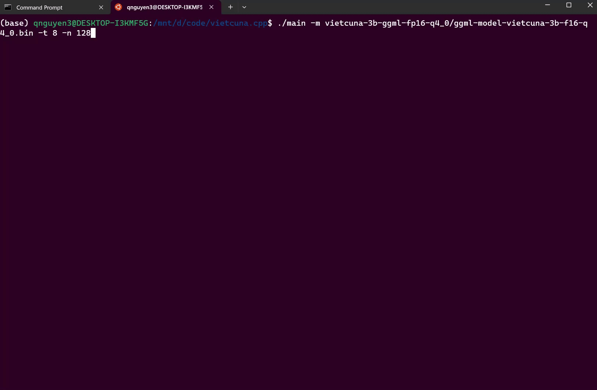

# Vietcuna.cpp

## Demo



## Hướng dẫn sử dụng
Chạy Vietcuna trên mọi thiết bị với C++

Trước hết hãy đảm bảo bạn đã cài C++ và git-lfs (https://git-lfs.com)

Bước 1:
```
git clone https://github.com/vilm-ai/vietcuna.cpp.git
cd vietcuna.cpp
make
```

Bước 2: Tải model từ HuggingFace
```
git lfs install
git clone https://huggingface.co/vilm/vietcuna-3b-ggml-fp16-q4_0
```
or the non-quantized version
```
git lfs install
git clone https://huggingface.co/vilm/vietcuna-3b-ggml-fp16
```

Hoặc tải trực tiếp từ HuggingFace

- Quantized version: [Tại Đây](https://huggingface.co/vilm/vietcuna-3b-ggml-fp16-q4_0)
- Non-quantized version: [Tại Đây](https://huggingface.co/vilm/vietcuna-3b-ggml-fp16)

Bước 3: Khởi chạy model
./main -m .vietcuna-3b-ggml-fp16-q4_0/ggml-model-vietcuna-3b-f16-q4_0.bin -t 8 -n 128

## Bộ nhớ

| Model | Disk | Mem |
| --- | --- | --- |
| `vietcuna-3b-ggml-fp16-q4_0` | 2.0 GB | 2.3 GB |
| `vietcuna-7b-ggml-fp16-q4_0` | 4.7 GB | 5.3 GB |